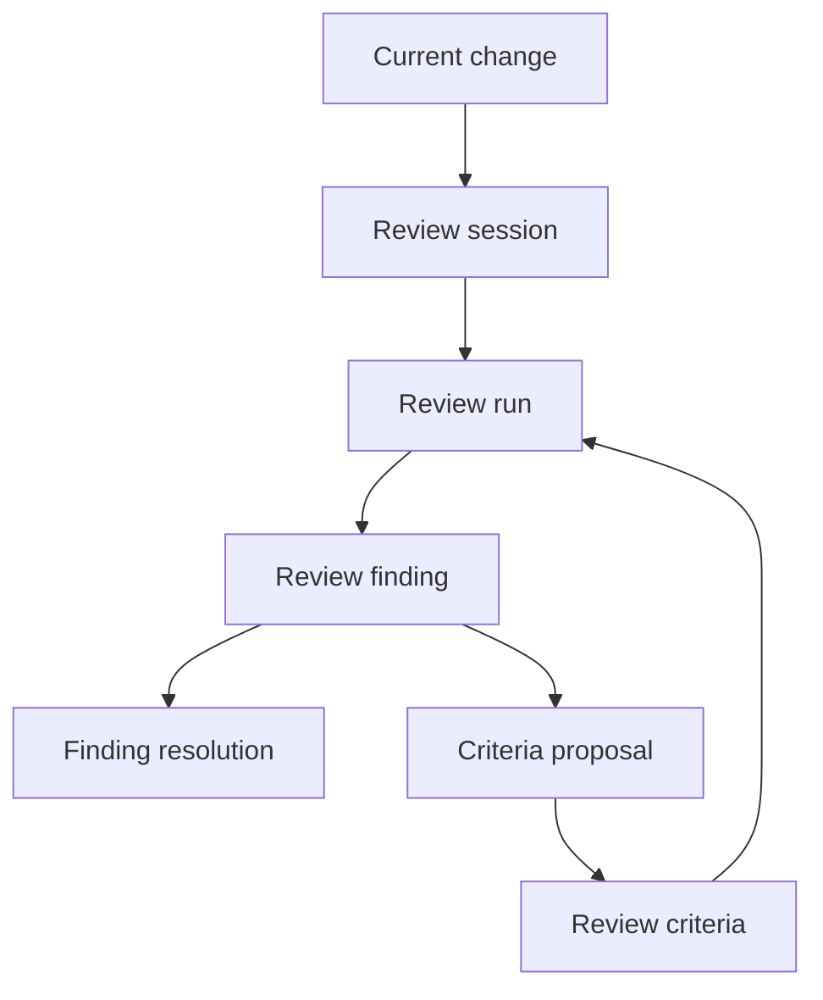
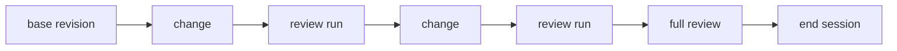
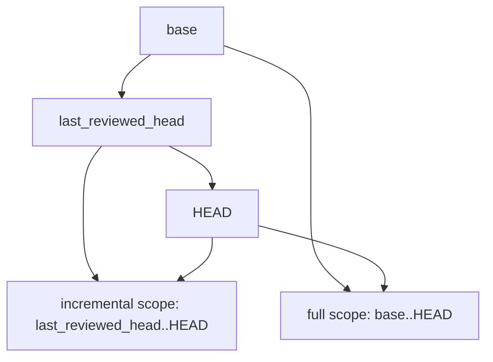
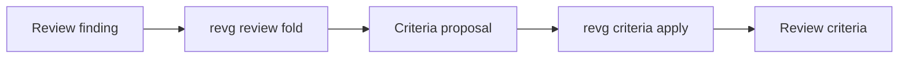
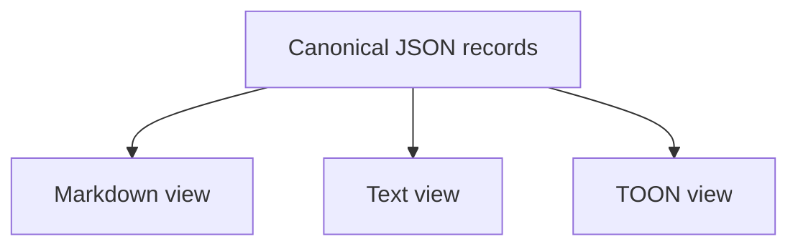

# Model

This document defines the core model of reviewography.

## Overview

reviewography separates concrete review events from reusable review knowledge.



## Review session

A review session is a worktree-local review procedure.

A session begins with a required base revision:

```bash
revg review start --base main
```

The base revision defines the whole change under review.

A session may contain multiple review runs as the implementation changes.



## Review cursor

A session separates the stable base revision from the review cursor.

```json
{
  "base": "main",
  "current_head": "HEAD",
  "last_reviewed_head": "abc123"
}
```

`base` is stable for the session.

`last_reviewed_head` records the head revision reviewed by the previous run.

This lets reviewography support two review scopes:



`incremental` focuses on changes since the previous review while keeping the whole-session context available.

`full` reviews the whole change from base to head.

## Review run

A review run is one execution of:

```bash
revg review run
```

A run:

1. reads the active session
2. computes review scope
3. loads relevant criteria
4. loads unresolved findings
5. builds review context
6. invokes one configured review agent
7. validates structured output
8. retries if the output is schema-invalid
9. records valid findings
10. updates the review cursor

A review run does not fix code and does not start a loop.

## Review finding

A review finding is a concrete issue produced by a review run.

Example:

```json
{
  "artifact_type": "review_finding",
  "schema_version": "0",
  "id": "finding-20260622-001",
  "category": "test-gap",
  "severity": "medium",
  "target": {
    "kind": "file",
    "path": "cmd/root_test.go"
  },
  "claim": "The output format flag is not tested together with command-level flags.",
  "evidence": [
    {
      "kind": "diff",
      "path": "cmd/root.go",
      "note": "The output format flag is parsed globally."
    }
  ],
  "recommended_action": "Add an integration test for global output flags combined with command-specific flags.",
  "resolution": "unresolved"
}
```

Findings are session-local records. They should not be treated as reusable criteria until they are folded into a proposal and explicitly applied.

## Finding resolution

A finding can be resolved with an explicit resolution state.

Suggested states:

```text
fixed
rejected
deferred
accepted-negative
superseded
duplicate
```

`accepted-negative` is used when a rejected concern becomes a future review policy.

For example, if compatibility concerns should not block pre-release simplification, that rejection itself can become reusable review knowledge.

## Review criteria

A review criterion is reusable review knowledge.

Example:

```json
{
  "artifact_type": "review_criteria",
  "schema_version": "0",
  "id": "criteria-hidden-command-help-visibility",
  "title": "Hidden command visibility should be tested through help output",
  "body": "When a CLI command is hidden, its visibility should be verified through user-facing help output rather than only through implementation flags.",
  "weight": 5,
  "status": "active"
}
```

Criteria are canonical JSON records.

Human-readable Markdown, text, and TOON output are generated views.

## Criteria weight

`weight` means review priority.

It is not an occurrence count.

A criterion may occur often but have low review priority. Another criterion may occur rarely but be important when relevant.

## Criteria proposal

`revg review fold` creates criteria proposals from findings in the active session.



A proposal is not applied automatically.

This prevents a single AI review comment from silently becoming future review policy.

## Canonical data and views

reviewography treats structured data as canonical.



Generated views are temporary and should be regenerated from canonical data when needed.
