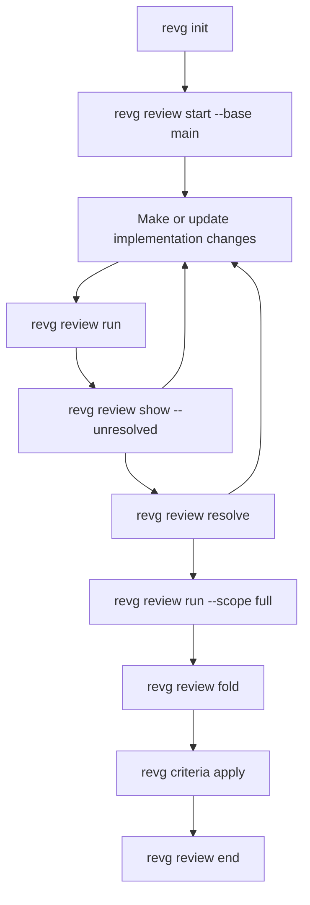
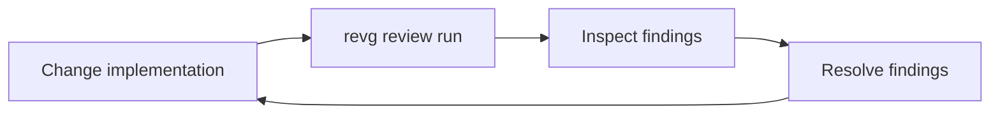
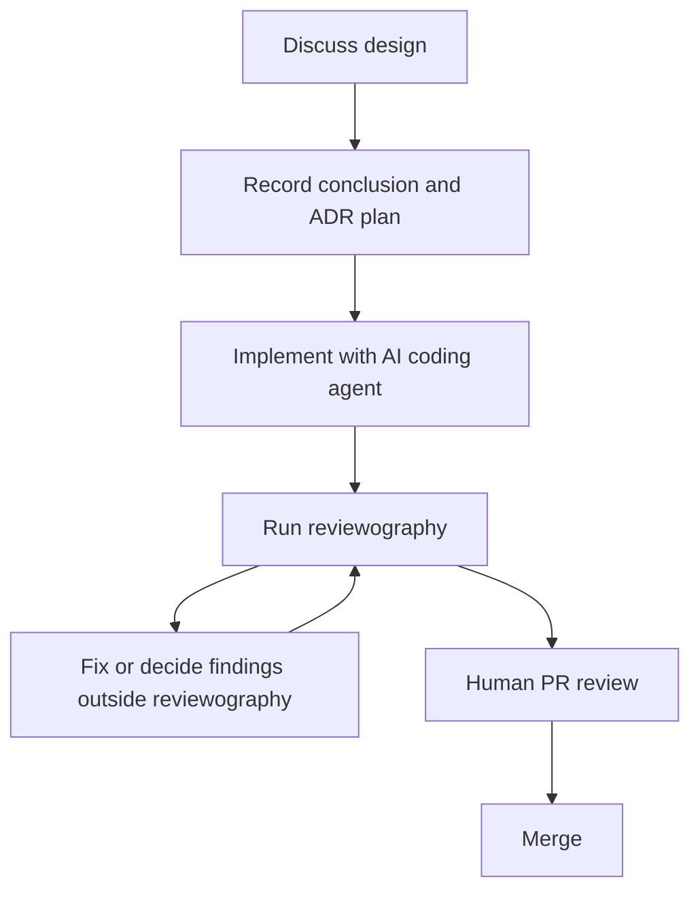

# Workflow

This document describes how reviewography is used during a review session.

For the underlying data model, see [Model](model.md).

For command details, see [Command index](command.md).

For configuration, see [Configuration](configuration.md).

## Core flow



The implementation and review loop happens outside reviewography.

reviewography records and manages review findings, but it does not fix code.

## 1. Initialize the repository

```bash
revg init
```

This creates the local reviewography structure and a project-local config file.

The config file is normally:

```text
reviewography.config.kdl
```

## 2. Start a review session

```bash
revg review start --base main
```

`--base` is required.

The session is worktree-local. When Git worktrees are used, each worktree should have its own active session file.

The session stores the base revision and a review cursor. See [Model](model.md) for the cursor model.

## 3. Make changes outside reviewography

Implementation may be done by a human or by an AI coding agent.

reviewography does not own that work.

## 4. Run an incremental review

```bash
revg review run
```

This is equivalent to:

```bash
revg review run --scope incremental
```

An incremental review focuses on changes since the previous review run while still using the whole-session context, unresolved findings, and relevant criteria.

The command invokes one configured review agent.

If the agent output is not valid according to the expected schema, reviewography asks the agent to regenerate the output up to `max_attempts`.

## 5. Inspect unresolved findings

```bash
revg review show --unresolved
```

Findings are concrete review comments from review runs.

They are not reusable criteria until they are folded into a proposal and applied.

## 6. Resolve findings

After external fixes or decisions, resolve findings explicitly.

```bash
revg review resolve <review-id> --as fixed
```

Other resolution states include:

```text
rejected
deferred
accepted-negative
superseded
duplicate
```

`accepted-negative` records that a rejected concern should itself influence future reviews.

## 7. Repeat as needed

The normal loop is:



The loop is driven by a human, skill, script, or another workflow tool.

reviewography provides the review memory and structured records.

## 8. Run a full review

Before human review, PR creation, or session end, run:

```bash
revg review run --scope full
```

A full review examines the whole change from the session base to the current head.

There is no special final review scope. A full review may still produce findings.

## 9. Fold findings into criteria proposals

```bash
revg review fold
```

`fold` creates criteria update proposals from the session findings.

It does not update criteria directly.

## 10. Apply selected criteria proposals

Apply a proposal to repository-level criteria:

```bash
revg criteria apply --local <proposal-id>
```

Apply a proposal to user-level criteria:

```bash
revg criteria apply --global <proposal-id>
```

Repository-level criteria should be preferred when review behavior must be shared or reproducible.

User-level criteria are environment-dependent and may not behave well with devcontainers or CI.

## 11. End the review session

```bash
revg review end
```

Ending the session clears the active session pointer.

It should not delete canonical findings, run records, or criteria proposals.

If unresolved findings remain, the command should warn.

## Multi-agent review

reviewography does not orchestrate multi-agent review.

One config means one review agent.

If multi-agent review is needed, run separate processes with separate config files:

```bash
revg review run -c reviewography.codex.kdl
revg review run -c reviewography.claude.kdl
```

reviewography does not merge, deduplicate, or reconcile those findings automatically.

## GitHub PR review comments

Manual human review is expected to happen through GitHub PR comments or reviews.

Importing PR comments into reviewography is outside the current workflow.

That capability should be designed together with a future GitHub Action that can translate PR comments into structured reviewography findings.

## Larger development flow

A larger AI-assisted development workflow may use reviewography like this:



reviewography participates in the review step, but it does not own the entire development workflow.
